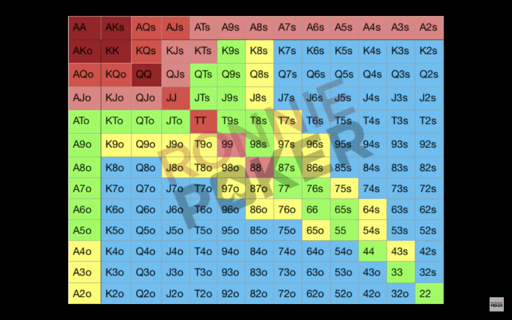

### poker笔记（短筹）：

1. 牌力强弱表：

   

翻牌前可以无限制的bet的牌型，位置靠前的时候直接 4 BB， 位置靠后 前面没有加注 考虑 5 BB，前面加注可以4-bet 到 5 BB，

- AA / AKs / AQs / AJs / AKo / KK / QQ / QJs / KJs / KTs / ATs / JJ /  大于 10 的口袋对 以及一些大的同花牌；

翻牌前 3 - bet 的牌，这些牌都进行 3-bet 入池 ;这些牌基本打到 3 - 4 BB 可以进行平跟 可以加注，位置如果靠后 前面没有加注 3-bet 4 BB，前面有加注可以考虑跟注（看对手的形象）。如果位置靠前 直接 2BB 看牌； 

- TT / 其他的大于 10 的牌不同色；

尽量打翻牌前，或者营造出两个人入池的情况，在两个人入池的情况下可以更好的判断入池的人的手牌范围，基本上打走了小牌 limp 入池的人。这时候也要根据不同的人的风格判断入池的牌；

- 大概对手大概 在 55 以上的对子，和自己牌力相近的牌；

翻牌后如果没有击中大牌：

#### 1. **非对子的不同花高牌**

牌面的潮湿程度决定是不是要等一个 「大对子」 ，等牌的牌数大概为 **6** 张牌，那么此时：

- 转牌等到对子的概率是 6 * 2 = 12 % 也就是  1:9 的概率，此时的赢面很小，只适合 check 看牌，如果对面 raise 可以考虑弃掉手牌；
- river 等到对子的概率 大概是 24 % 也就是 1:4 的概率，如果你确定你可以跟到 river 那么可以判断；
- 综上的所述：不应该继续投入下注去看牌，应该弃掉；

#### 2. **听同花**：

在听同花的情况下如何判断下注：

- 单纯的听同花：此时等的牌数为 9 那么只看到转牌的获胜概率是：18 % 的概率 大概是 1:6 ，根据 pot 中大概是 50，那么可以判断跟注 5-10 去看牌是合理的范围，这都是跟注的情况/或者位置靠前的情况。不一定按照只看到转牌计算，如果可以大概知道自己到 river 一共要投入多少筹码可以提前计算，如果确定要看到 river ，那么此时的获胜概率是 9 * 4 - （9 - 8）= 35 %  大概是 1: 2.5，那么在此轮和下一轮一共支付 20 筹码都是合理的范围；