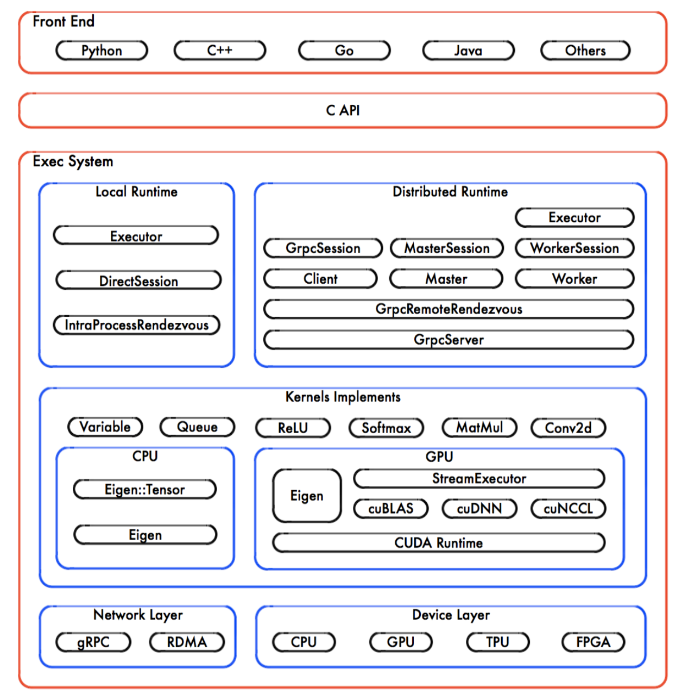
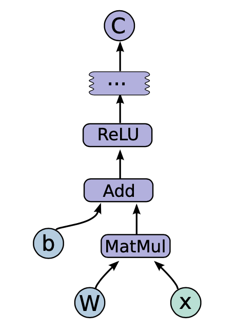
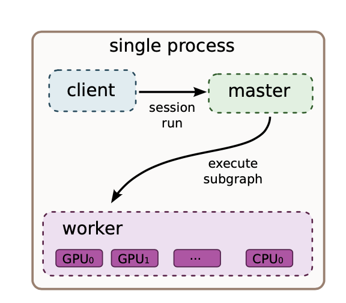
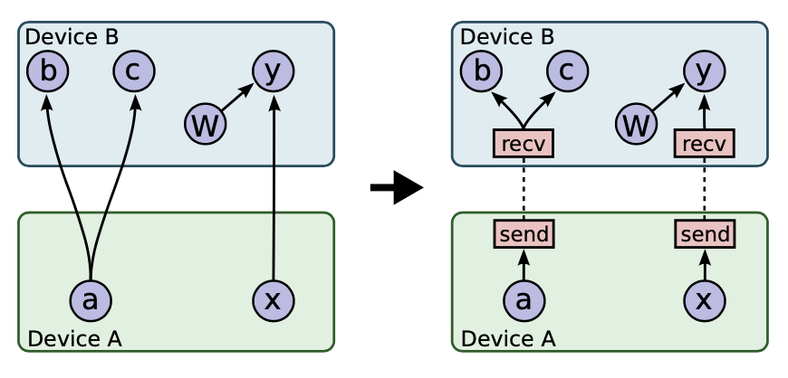
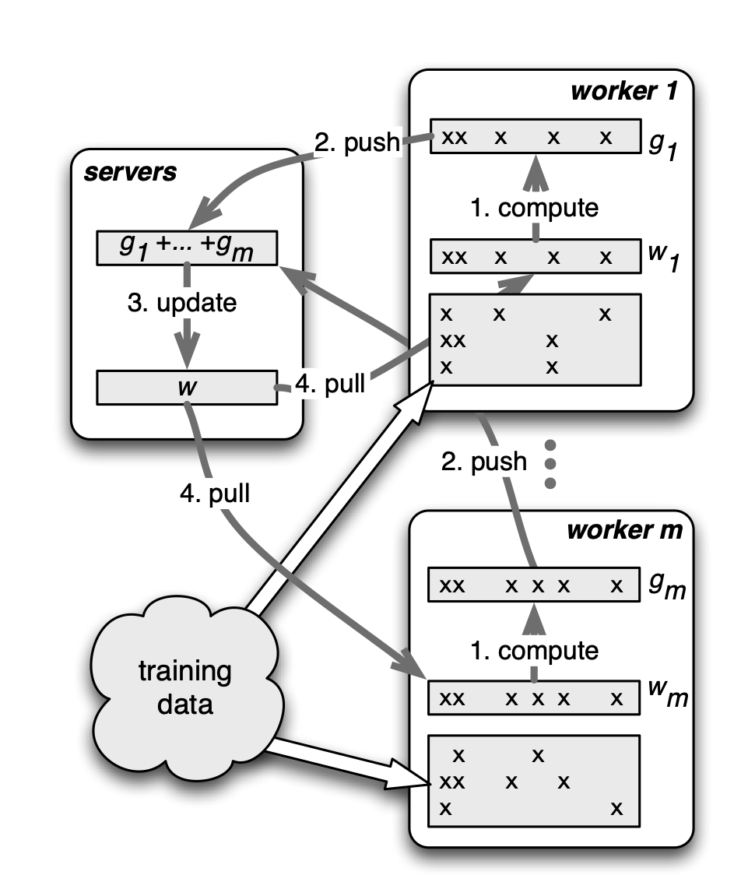

# Distributed TensorFlow

> Clients typically construct a computational graph using one of the supported frontend languages (C++ or Python). 
>
> ----《TensorFlow:Large-Scale Machine Learning on Heterogeneous Distributed Systems》

​	Client 构建 <u>计算图</u> ，通过这个 Client 可以利用不同的语言构建出计算图，算是最接近使用者的一层前端的东西了，如下图所示为（图片来自《TensorFlow 内核剖析》作者：刘光聪）：



> In a TensorFlow graph, each *node* has zero or more inputs and zero or more outputs, and represents the instantiation of an *operation*.
>
> ----《TensorFlow:Large-Scale Machine Learning on Heterogeneous Distributed Systems》

```python
import tensorflow as tf
b = tf.Variable(tf.zeros([100]))
W = tf.Variable(tf.random_uniform([784,100],-1,1)) x = tf.placeholder(name="x")
relu = tf.nn.relu(tf.matmul(W, x) + b)
C = [...]
s = tf.Session()
for step in xrange(0, 10):
	input = ...construct 100-D input array ... 
  result = s.run(C, feed_dict={x: input}) 
  print step, result
```

​	在 Tensorflow 的计算图当中，每一个节点代表着操作的实例化。那么都是什么操作呢？大概举了几个例子如下表所示，针对不同的结构的数据产生了不同类型的 Operation，每一种的 OP 中都有许多不同的具体的操作。具体的计算图如图所示（来自《TensorFlow:Large-Scale Machine Learning on Heterogeneous Distributed Systems》）：

| OP                                   | Example                                                   |
| ------------------------------------ | --------------------------------------------------------- |
| Matrix operations                    | MatMul, MatrixInverse, MatrixDeterminant, ...             |
| Array operations                     | Concat, Slice, Split, Constant, Rank, Shape, Shuffle, ... |
| Queue and synchronization operations | MutexAcquire, MutexRelease, ...                           |
| Element-wise mathematical operations | Add, Sub, Mul, Div, Exp, Log, Greater, Less, Equal, ...   |

​	其中的 w，x，b便是输入的参数，通过每一个节点的OP操作最终输出，这个整体便构成了一个计算图，而 Client 的作用便是构建这个计算图，包含变量的定义。当数据输入的时候，便开始按照计算图的定义开始运转。



> Clients programs interact with the TensorFlow system by creating a *Session*.

​	Client 通过 Session 来和“后端”建立起联系，从而运行整个计算图。在单机单卡的情况下如下图所示工作，在一个机器的一个进程上上存在 master 和 worker 。



> Once a system has multiple devices, there are two main complications: deciding which device to place the com- putation for each node in the graph, and then managing the required communication of data across device bound- aries implied by these placement decisions. This subsec- tion discusses these two issues.

​	而这个“后端”的功能便是负责执行整个计算图，在单机单卡的情况下都在一个设备上进行运行也并不需要很多复杂的操作。在单机多卡的情况下，一个 master 会对应多个 worker ，master 的作用是将计算图的多个子图的片段分配给多个worker service（如下图所示）。但是当出现单机多卡的情况下如何快速的执行计算图存在两个主要问题：

- 将计算图分配给不同的设备；
- 设备之间的通信问题；


> One input to the placement algorithm is a cost model, which contains estimates of the sizes (in bytes) of the input and output tensors for each graph node, along with estimates of the computation time required for each node when presented with its input tensors. This cost model is either statically estimated based on heuristics associated with different operation types, or is measured based on an actual set of placement decisions for earlier executions of the graph.

​	将计算图分配给不同的设备主要是将计算图中的节点分配给不同的设备，那么这个分配方式主要是根据一个算法来判断的。这个算法不仅基于输入输出张量的大小以及对应的操作OP的时间的预估计进行分配，也会在后续计算图实际的早期计算中来判断当前的分配方式的合理程度。是否合理应该是主要还是根据时间来判断的，但在原文中可能将时间量化成了某种的cost。

​	如何处理设备之间的通信问题，就是如果存在子图之间的节点需要相互传输数据的时候那么此时在需要发送数据的节点上添加新的 send 节点，在需要接收数据的部分添加 recieve 节点，如下图所示：



​	上面主要阐述了在单机多卡的情况下如何构建一个计算图，并将一个完整的图如何分配到不同的设备进行工作并完成设备之间的信息传输的。总的来说：

- Client 通过运行 Session 调度 master去分配每一个 worker 合适的 subgraph 也就是整个图的部分的节点；
- 为了保证在不同的设备上的节点的正常的通信，通过在每一个设备上的节点增加 recieve 和 send 节点；


​	根据 cafair10 的多GPU 官方示例代码可以看出在使用多 GPU 的时候的一种的训练的思路，就是将数据分成多份（这里指的是从一个batch的数据当中分出GPU个数的份数），每一个 GPU 共享参数，自己训练自己的，只要将计算的梯度最后汇总在一起求均值再对参数进行更新。其中参数可以放在 CPU 中（如下图所示）所以整体的速度取决于最慢的那个 GPU ：


> Distributed execution of a graph is very similar to multi- device execution. After device placement, a subgraph is created per device. Send/Receive node pairs that com- municate across worker processes use remote communi- cation mechanisms such as TCP or RDMA to move data across machine boundaries.

​	TF 的分布式情况下和单机多卡的情况比较类似，都是需要将完整的计算图分成多个子图然后加上 recieve 和 send 节点之后进行通信，与单机单卡的区别在于其中的通信方式不同。

> A TensorFlow “cluster” is a set of “tasks” that participate in the distributed execution of a TensorFlow graph. Each task is associated with a TensorFlow “server”, which contains a “master” that can be used to create sessions, and a “worker” that executes operations in the graph. A cluster can also be divided into one or more “jobs”, where each job contains one or more tasks.

​	cluster 可以理解为由许多的 task 组成的，每一个 task 由一个 master 负责，而 master 负责协调多个 worker 之间的工作。并且对 cluster 的划分方式还可以不由 task，换种方式由 job 来划分，运行在一个 cluster 上可能是多个或一个 job ，不同的类型的 job 包含多个 task。在运行的过程中，每一个 task 对应一个 master / server，在这个task上：

-  创建一个 tf.train.ClusterSpec 用来描述当前的 task 是什么类型的 task 并运行在机器的位置，是cpu还是 GPU，还会说明其他的每一个 task 的运行的位置与状况。
- 创建好一个 server 将对整个集群的描述都传入进去，并在本机器上建立好对应的 host，每一个机器上都建立好之后那么整个集群就建立好了。


​	上面的描述中可以知道的是如何构建一个 cluster 并且在 cluster 上会分成不同类型的 job 从而进行分配合适的task 给不同的机器，在每一个机器上都会存在一个 server，这个 server 会对应一个 master 用来协调不同的worker 之间的工作。这里存在一个问题就是不同的类型的 job 是如何划分的？在 TF 的分布式架构中采用的是parameter server 的架构，job 会分为（如图所示）：图片来源（Scaling Distributed Machine Learning with the Parameter Server）

- parameter server ：负责更新参数；
- worker：计算梯度；




​		

​	在分布式的训练过程中一般会分为两种的训练情况：

- 模型上的并行；
- 数据上的并行；

​	数据上的并行是比较常用的一种情况，而在数据并行上还分为同步更新（就是类似 cafair10 的例子）和异步更新。异步更新每一个设备计算完梯度都去更新参数。数据上的并行训练在 Distributed TF 当中被称为 Replicated training：

- IN-GRAPH：一个 Client，一个 Session，通常采用的是同步更新；
- BETWEEN-GRAPH：多个 Client，多个 Session，同步更新或者异步更新；