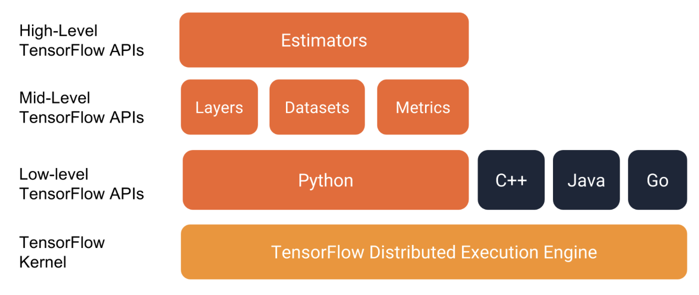

# estimater && feature_column

​	在 tensorflow 中如何利用 feature_column 处理数据并利用 estimater 构造 tensorflow 模型。

## 1. Estimater 

​	estimator 是 tf 中的一个高级的 API，在 tensorflow 整体的结构中的位置如图所示（图片来自https://www.cnblogs.com/marsggbo/p/11232897.html）。可以看出 estimater 处于一个比较接近用户层面的 API 可以在estimater 使用很多的 mid-leval 的API：

​	下面将整体的结构列出来，本文将从下面的几点中进行逐渐剖析 Estimater 的用法：在使用 estimater 的时候需要调用的是train-and-evalate 函数，而这个函数需要的是Estimater / TrainSpec / EvalSpec 三个参数，这三个参数分别为针对模型的一些参数以及模型本身的构造的一个对象 Estimater，训练的时候需要的训练数据输入的对象 TrainSpec，以及评估中需要的参数 EvalSpec。

- Estimater : tf.estimater.Estimater 对象；
- TrainSpec : tf.estimater.TrainSpec 对象；
- EvalSpec : tf.estimater.EvalSpec 对象；

### 1.1 tf.estimater.Estimater

​	tf.estimater.Estimater 中的几个参数中最重要的就是 model_fn 这个参数，model_fn 代表的是一个模型的定义的函数，在输入的 model_fn 中是一个定义好结构的确定的 tf 模型。

​	而在介绍 model_fn 这个模型定义函数的时候主要由如下几个参数需要定义：

- features：代表的是输入的数据；
- labels：代表的是样本的标签；
- mode：代表的是模式主要分为训练模式/评估模式/预测模式；
- params：一些参数，这个参数一般是一个字典的格式，这个

在进行基于tensorflow 的模型的运行的时候，需要将各种格式的数据进行处理再进行运行。对数据的处理方式可以利用feature-column的方式进行处理，其中fc主要由两种形式的数据：

- dense Tensor：一般面对的是数值型的数据；对应的处理是dense-column；
- sparse Tensor：一般面对的是类别形式的数据；对应的处理方式是categorical column；

首先介绍的是 dense-column：

### numeric column：

整体的逻辑就是：

1. 存在一个data；
   1. 再存在data的基础上利用 lazybuilder 对数据进行包装，防止多次复制的操作；
2. 设定一个再data里面找的字段，针对字段的操作；
   1. 可以利用 get-dense-tensor 操作配合包装好的builder得到相应的dense-tensor；
   2. 可以利用input-layer直接得到相对应的 tensor ；

在numeric-colum的基础上可以得到buckesize-column：

buckesize-column的作用就是将numeric的column离散化；

Sparse_tensor 和 Dense_tensor 的区别是什么？